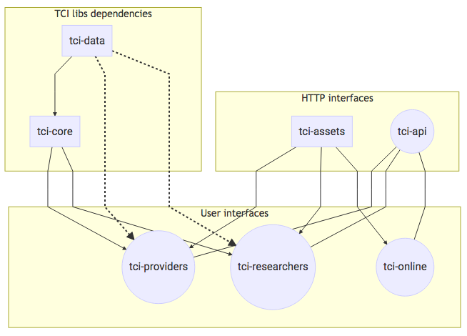

# TCI plateforms interactions

This diagram presents the dependencies and interactions between the various
TCI platerforms and libraries.



```
graph TB
%% declaring the systems
data[tci-data]
providers((tci-providers))
researchers((tci-researchers))
online((tci-online))
core[tci-core]
assets[tci-assets]
api((tci-api))

subgraph User interfaces
  providers
  researchers
  online
end

subgraph HTTP interfaces
  assets --> providers
  assets --> researchers
  assets --> online
  api---providers
  api---researchers
  api---online
end

subgraph TCI libs dependencies
  data-->core
  core-->providers
  data-.->providers
  core-->researchers
  data-.->researchers
end
```

[Edit this diagram online](http://knsv.github.io/mermaid/live_editor/#/edit/Z3JhcGggVEIKc3ViZ3JhcGggVXNlciBpbnRlcmZhY2VzCiAgYzEoKHRjaS1wcm92aWRlcnMpKQogIGMyKCh0Y2ktcmVzZWFyY2hlcnMpKQogIGMzKCh0Y2ktb25saW5lKSkKZW5kCgpzdWJncmFwaCBIVFRQIGludGVyZmFjZXMKICB0Y2ktYXNzZXRzIC0tPiBjMQogIHRjaS1hc3NldHMgLS0-IGMyCiAgdGNpLWFzc2V0cyAtLT4gYzMKICBjNCgodGNpLWFwaSkpLS0tYzEKICBjNCgodGNpLWFwaSkpLS0tYzIKICBjNCgodGNpLWFwaSkpLS0tYzMKZW5kCgoKc3ViZ3JhcGggVENJIGxpYnMgZGVwZW5kZW5jaWVzCiAgICB0Y2ktZGF0YS0tPnRjaS1jb3JlCiAgICB0Y2ktY29yZS0tPmMxCiAgICB0Y2ktZGF0YS0uLT5jMQogICAgdGNpLWRhdGEtLi0-YzIKICAgIHRjaS1jb3JlLS0-YzIKICAgIGVuZA)
